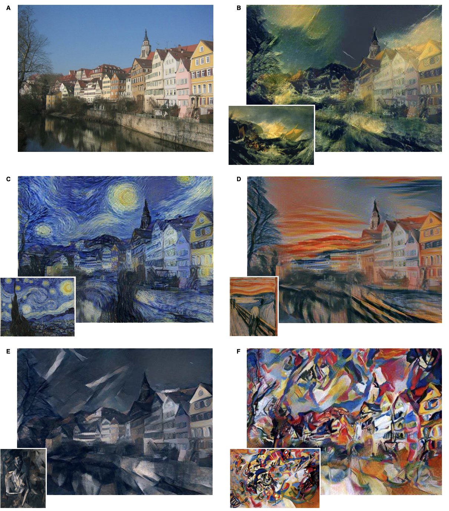
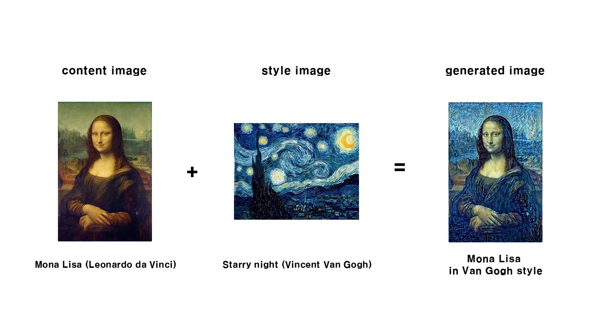

## Style Transfer
---

- inflearn 강좌 따라 만들어본 논문 구현
- 아래는 논문에서 제공한 style image에 따른 결과물 예시

#### 요약
- content image에 style image의 style을 새로 입히는 기법
- VGG19의 일부 레이어를 가져와서 Transfer model 구성
- Content loss와 Style loss 구현 (일부 수식은 생략, 핵심 loss만 구현)

#### 결과
- 전처리 과정에 image resize 과정이 있어 결과물은 정사각형으로 나옴 (아래 결과물은 사이즈만 재조정함)
- content image에 style image의 style이 입혀진 것을 볼 수 있음

- 논문 링크: [A Neural Algorithm of Artistic Style (2015.08)](https://paperswithcode.com/paper/a-neural-algorithm-of-artistic-style)